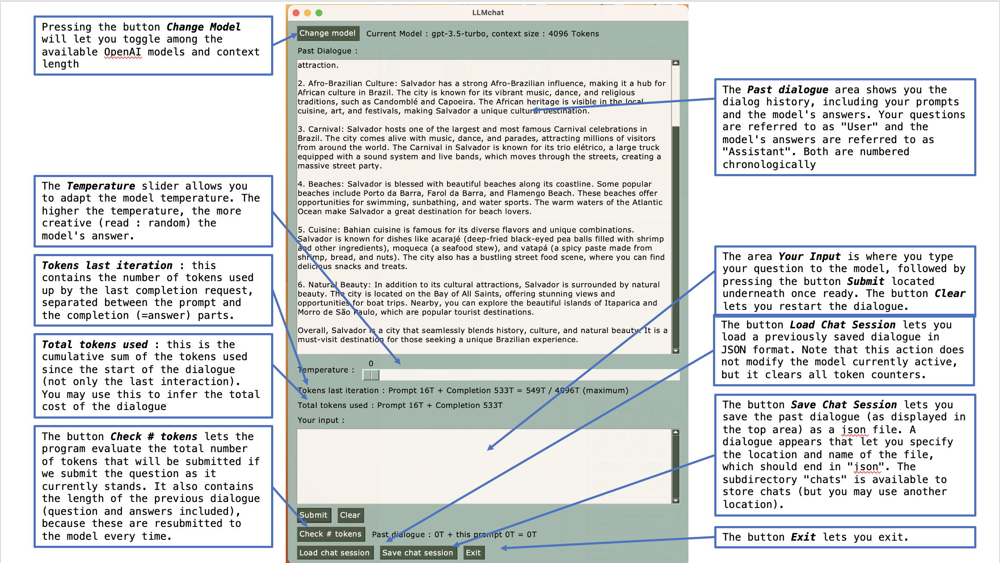

# llmchat

## Main features

This program provides a window GUI chat interface to OpenAI ChatGPT.
Advantages of this program compared to the OpenAI web interface :

* The interface allows you to select between *ChatGPT3.5* and *ChatGPT4*, and use *ChatGPT4* even if you don't have the ChatGPT+ subscription (but you need to have an OpenAI API subscription);
* The interface also allows you to select the extended context length interfaces (16k tokens for ChatGPT3.5 and 32k tokens for ChatGPT4); please note that these models are more costly to use;
* You can estimate tokens to be sent (prompt) by clicking *check # Tokens*;
* You can follow the token consumption of the previous iteration and the cumulative total (for fee estimation);
* You can select the temperature f the model (the amount displayed is divided by 100, so 100 means Temperature=1);
* You can load and save chat sessions in JSON format (which also allows for offline viewing and edition using a text editor).

## Installation instructions

* First, download and install the package using `git clone https://github.com/ArnaudStevins/llmchat.git`
* Second, go to the llmchat directory and create a Python virtual environment using the command `python3 -m venv myenv`
* Third, activate the environment using the command `source myenv/bin/activate`
* Fourth, install the required packages in the environment using `pip install -r requirements.txt`
* Fifth, open a text editor and store your OpenAI API KEY in a .env file in the same directory as the llmchat.py file containing the following text :

> OPENAI_API_KEY=sk-xxxxxxxxxxxxxxxxxxxxxxx # (where you replace xxxxxxx by your key)

* And now, you can type `python llmchat.py` to start the program.

## Usage

Hereby a look at the Graphical User Interface on MacOS :

* At the top, you see the current model (by default : chatGPT-3.5). Pressing the button *Change Model* will let you toggle among the available OpenAI models;
* The *Past dialogue* area shows you the dialog history, including your prompts and the model's answers. Your questions are referred to as "User" and the model's answers are referred to as "Assistant". Both are numbered chronologically;
* The *Temperature* slider allows you to adapt the model temperature. The higher the temperature, the more creative (read : random) the model's answer. For programming code, you probably want to set the temperature to a low setting. For fiction writing, you might want to set it high.
* Now follows two indications of the number of tokens already consumed by the past dialogue (so not including the current prompt):

  * *Tokens last iteration* : this contains the number of tokens used up by the last completion request, separated between the prompt and the completion (=answer) parts. It is important to track these separately because OpenAI is charging different amounts per token for prompt and completion;
  * *Total tokens used* : this is the cumulative sum of the tokens used since the start of the dialogue (not only the last interaction). You may use this to infer the total cost of the dialogue (see below for details).

* The area *Your Input* is where you type your question to the model, followed by pressing the button *Submit* located underneath once ready.
* The button *Check # tokens* lets the program evaluate the total number of tokens that will be submitted if we submit the question as it currently stands. It also contains the length of the previous dialogue (question and answers included), because these are resubmitted to the model every time.
* The button *Save Chat Session* lets you save the past dialogue (as displayed in the top area) as a json file. A dialogue appears that let you specify the location and name of the file, which should end in "json". The subdirectory "chats" is available to store chats (but you may use another location).
* The button *Load Chat Session* lets you load a previously saved dialogue in JSON format. Note that this action does not modify the model currently active, but it clears all token counters.
* The button *Exit* lets you exit the program.

## Registering for OpenAI API Access

* First, you need to have an OpenAI account. This can be done by accessing the OpenAI website <https://openai.com> and clicking on *Sign Up* in the upper right. Then complete the registration process, which is fairly standard.

* Second, go to the OpenAI API main page here : <https://platform.openai.com/> and look at your account name in the top right. Click on your name and select "View API Keys" on the right.

* Now you're ready to create your key. Click on the button "Create New Secret Key", then give a name to the key and click "Create Secret Key". then immediately copy the key to the clipboard and paste it somewhere safe because it cannot be accessed again form the OpenAI website. It is for example a good time to paste it into the .env fie of llmchat.

* Then, you will need to set up billing. For this, click on "Billing" on the left menu and click "Payment Methods", add a credit card and make a prepayment by clicking "Add to credit balance".

* Finally, it is a good idea to set usage limits by clicking on "Usage Limits" to avoid any bad surprises. Note that "Usage Limits" are defined by you, while "Rate limits" are general upper usage bounds applicable to everyone using the API.

## Cost tracking

* for information on the OpenAI API pricing per token, please go to : <https://openai.com/pricing#language-models>

* for tracking your costs due to OpenAI API usage, go to : <https://platform.openai.com/account/usage>
